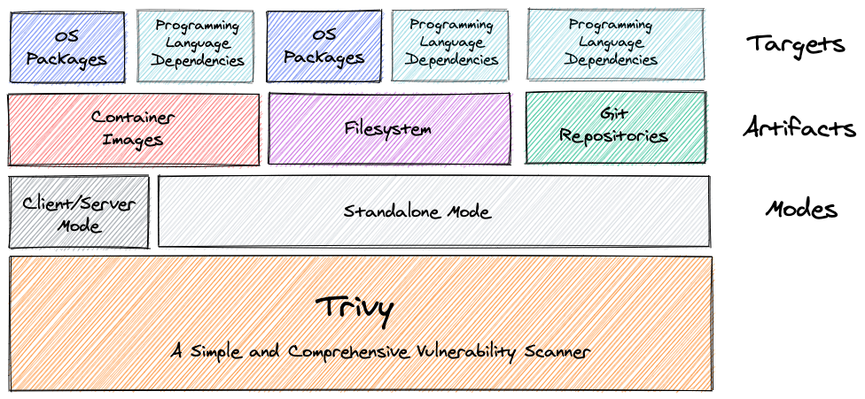
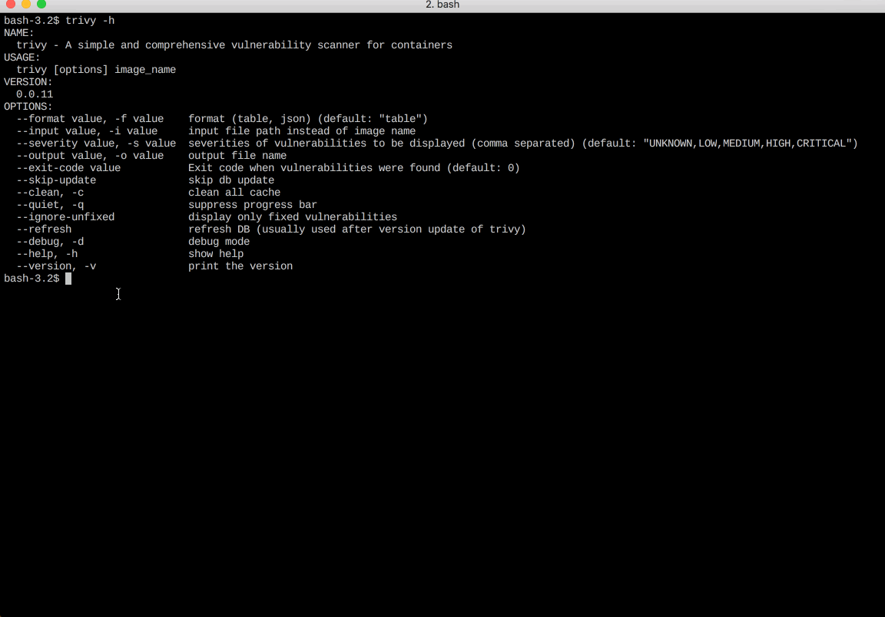
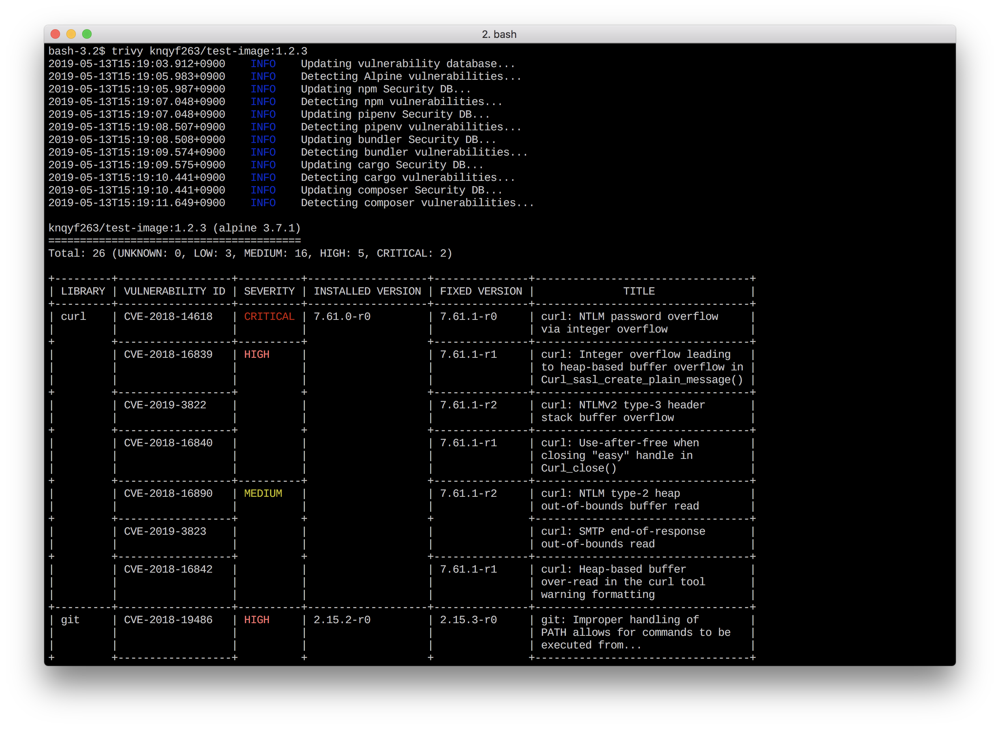
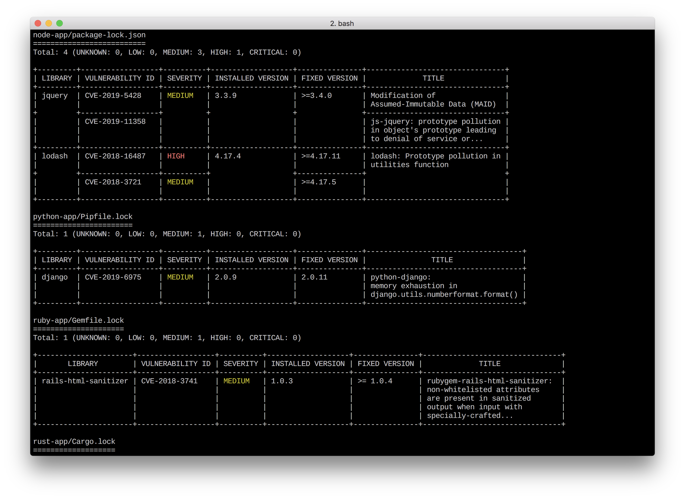

[![GitHub Release][release-img]][release]
[](https://goreportcard.com/report/github.com/khulnasoft-lab/vul)
[][license]
[](https://codecov.io/gh/khulnasoft-lab/vul)
[![GitHub All Releases][github-all-releases-img]][release]
![Docker Pulls][docker-pulls]

[release]: https://github.com/khulnasoft-lab/vul/releases
[release-img]: https://img.shields.io/github/release/khulnasoft-lab/vul.svg?logo=github
[github-all-releases-img]: https://img.shields.io/github/downloads/khulnasoft-lab/vul/total?logo=github
[docker-pulls]: https://img.shields.io/docker/pulls/aquasec/vul?logo=docker&label=docker%20pulls%20%2F%20vul
[license]: https://github.com/khulnasoft-lab/vul/blob/main/LICENSE


A Simple and Comprehensive Vulnerability Scanner for Containers and other Artifacts, Suitable for CI.

# Abstract
`Vul` (`tri` pronounced like **tri**gger, `vy` pronounced like en**vy**) is a simple and comprehensive vulnerability scanner for containers and other artifacts.
A software vulnerability is a glitch, flaw, or weakness present in the software or in an Operating System.
`Vul` detects vulnerabilities of OS packages (Alpine, RHEL, CentOS, etc.) and application dependencies (Bundler, Composer, npm, yarn, etc.).
`Vul` is easy to use. Just install the binary and you're ready to scan. All you need to do for scanning is to specify a target such as an image name of the container.



Vul can be run in two different modes:

- [Standalone](https://khulnasoft-lab.github.io/vul/latest/modes/standalone/)
- [Client/Server](https://khulnasoft-lab.github.io/vul/latest/modes/client-server/)

Vul can scan three different artifacts:

- [Container Images](https://khulnasoft-lab.github.io/vul/latest/scanning/image/)
- [Filesystem](https://khulnasoft-lab.github.io/vul/latest/scanning/filesystem/)
- [Git Repositories](https://khulnasoft-lab.github.io/vul/latest/scanning/git-repository/)





It is considered to be used in CI. Before pushing to a container registry or deploying your application, you can scan your local container image and other artifacts easily.
See [here](https://khulnasoft-lab.github.io/vul/latest/integrations/) for details.

# Features

- Detect comprehensive vulnerabilities
  - OS packages (Alpine, **Red Hat Universal Base Image**, Red Hat Enterprise Linux, CentOS, Oracle Linux, Debian, Ubuntu, Amazon Linux, openSUSE Leap, SUSE Enterprise Linux, Photon OS and Distroless)
  - **Application dependencies** (Bundler, Composer, Pipenv, Poetry, npm, yarn, Cargo, NuGet, Maven, and Go)
- Simple
  - Specify only an image name or artifact name
  - See [Quick Start](#quick-start) and [Examples](#examples)
- Fast
  - The first scan will finish within 10 seconds (depending on your network). Consequent scans will finish in single seconds.
  - Unlike other scanners that take long to fetch vulnerability information (~10 minutes) on the first run, and encourage you to maintain a durable vulnerability database, Vul is stateless and requires no maintenance or preparation.
- Easy installation
  - `apt-get install`, `yum install` and `brew install` is possible (See [Installation](#installation))
  - **No pre-requisites** such as installation of DB, libraries, etc.
- High accuracy
  - **Especially Alpine Linux and RHEL/CentOS**
  - Other OSes are also high
- DevSecOps
  - **Suitable for CI** such as Travis CI, CircleCI, Jenkins, GitLab CI, etc.
  - See [CI Example](#continuous-integration-ci)
- Support multiple formats
  - container image
    - A local image in Docker Engine which is running as a daemon
    - A local image in Podman (>=2.0) which is exposing a socket
    - A remote image in Docker Registry such as Docker Hub, ECR, GCR and ACR
    - A tar archive stored in the `docker save` / `podman save` formatted file
    - An image directory compliant with [OCI Image Format](https://github.com/opencontainers/image-spec)
  - local filesystem
  - remote git repository

Please see [LICENSE][license] for Vul licensing information. Note that Vul uses vulnerability information from a variety of sources, some of which are licensed for non-commercial use only.

# Documentation
The official documentation, which provides detailed installation, configuration, and quick start guides, is available at https://khulnasoft-lab.github.io/vul/.

# Installation
See [here](https://khulnasoft-lab.github.io/vul/latest/installation/)


# Quick Start

Simply specify an image name (and a tag).

```
$ vul image [YOUR_IMAGE_NAME]
```

For example:

```
$ vul image python:3.4-alpine
```

<details>
<summary>Result</summary>

```
2019-05-16T01:20:43.180+0900    INFO    Updating vulnerability database...
2019-05-16T01:20:53.029+0900    INFO    Detecting Alpine vulnerabilities...

python:3.4-alpine3.9 (alpine 3.9.2)
===================================
Total: 1 (UNKNOWN: 0, LOW: 0, MEDIUM: 1, HIGH: 0, CRITICAL: 0)

+---------+------------------+----------+-------------------+---------------+--------------------------------+
| LIBRARY | VULNERABILITY ID | SEVERITY | INSTALLED VERSION | FIXED VERSION |             TITLE              |
+---------+------------------+----------+-------------------+---------------+--------------------------------+
| openssl | CVE-2019-1543    | MEDIUM   | 1.1.1a-r1         | 1.1.1b-r1     | openssl: ChaCha20-Poly1305     |
|         |                  |          |                   |               | with long nonces               |
+---------+------------------+----------+-------------------+---------------+--------------------------------+
```

</details>

# Examples
See [here](https://khulnasoft-lab.github.io/vul/latest/examples/filter/)

# Continuous Integration (CI)
See [here](https://khulnasoft-lab.github.io/vul/latest/integrations/)

# Vulnerability Detection
See [here](https://khulnasoft-lab.github.io/vul/latest/vuln-detection/)

# Usage
See [here](https://khulnasoft-lab.github.io/vul/latest/usage/)

# Author

[KhulnaSoft DevOps](https://github.com/knqyf263) (knqyf263)
